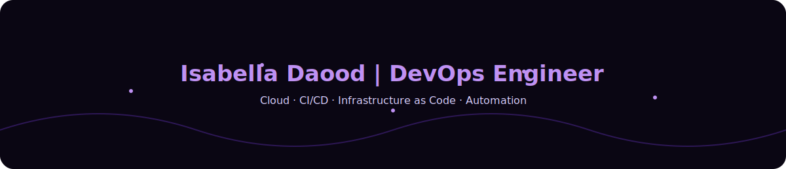

<!-- walkercyber/README.md -->

  

  

  

---

I'm currently studying **.NET Cloud Developer** at *IT-Högskolan* to become a master in **full stack development**.  
I have worked a lot in the industry and seen much that can be automated.  
My mind is curious and a bit lazy (in a good way 😋), and that is why I’m always looking to **improve workflows with technology** — which is what made me start this new journey.  

---

  

  
  

---

If you are like-minded, I’m always open to new opportunities.  
You’re welcome to connect with me on my socials — or if you’d like to get carried in **Valorant**, I can be generous... occasionally 🎮  

  

  

